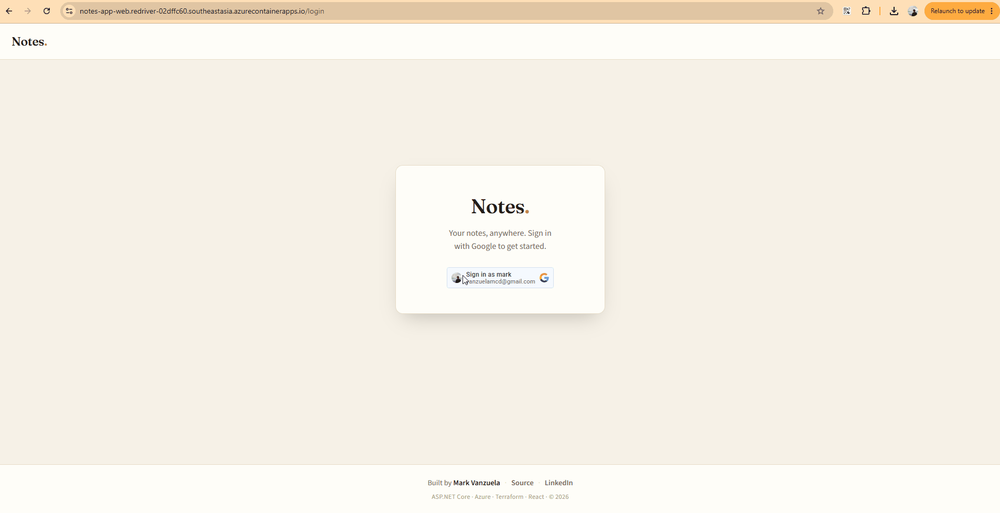

# Notes App

A full-stack notes application with Google sign-in — built end-to-end (frontend, API,
database, containers, CI/CD, and cloud infrastructure) as a demonstration of full-stack
and DevOps skills.

**▶︎ Live demo:** https://notes-app-web.redriver-02dffc60.southeastasia.azurecontainerapps.io

> The app runs **scale-to-zero** on Azure, so the **first request after it's been idle
> takes ~10–20s** to wake up (both the app and the serverless database). Subsequent
> requests are instant.



---

## Highlights

- **Clean, layered backend** — ASP.NET Core 8 with Clean Architecture + CQRS (MediatR),
  FluentValidation, centralized error handling, and EF Core 8 / PostgreSQL.
- **Real auth** — Google sign-in (ID token) exchanged for an app-issued **JWT**, with
  **per-user data isolation** enforced from token claims (never client input).
- **Containerized & cloud-native** — multi-stage Docker images on **Azure Container Apps**
  (scale-to-zero), serverless **Neon** Postgres, health probes.
- **CI/CD done properly** — GitHub Actions with **required test checks + branch
  protection**, image publishing to **GHCR**, and **passwordless (OIDC) deploys** that run
  database migrations and roll the container image on merge to `main`.
- **Infrastructure as Code** — the entire Azure environment is **Terraform** (`azurerm`),
  with remote state, a budget alert, and a Log Analytics ingestion cap.
- **Tested on both tiers** — xUnit/Moq (API) and Vitest/React Testing Library (frontend).

## Tech stack

| Area | Technologies |
| --- | --- |
| **Frontend** | React 19, Vite, TypeScript, Redux Toolkit, React Router, Vitest + React Testing Library |
| **Backend** | C# / ASP.NET Core 8, Clean Architecture, CQRS (MediatR), FluentValidation, EF Core 8, xUnit + Moq |
| **Database** | PostgreSQL 16 — local via Docker; **Neon** serverless in production |
| **Auth** | Google OAuth → app-issued JWT (HMAC), per-user authorization |
| **DevOps** | Docker (multi-stage), Docker Compose, GitHub Actions, GitHub Container Registry, **Terraform**, **Azure Container Apps**, OIDC federation, Log Analytics |

## Architecture

```
                         Azure Container Apps (scale-to-zero)
                      ┌───────────────────────────────────────┐
  Browser ──HTTPS──►  │  web (nginx + React SPA)              │
                      │        │                              │
                      │        ▼  HTTPS / JSON (+ Bearer JWT)  │        ┌──────────────┐
                      │  api (ASP.NET Core 8)  ──Npgsql/EF──►──┼──────► │  Neon         │
                      └───────────────────────────────────────┘        │  PostgreSQL   │
                                  ▲   pulls images                      └──────────────┘
                                  │
   GitHub  ──push to main──►  CI: build + test ──► publish images ──► GHCR
                             CD: OIDC login ──► migrate ──► az containerapp update
   Infra:  Terraform (azurerm) provisions the environment above
```

This is a **monorepo**; the frontend and API build and deploy **independently** via
path-aware workflows.

## Repository layout

| Path | Purpose |
| --- | --- |
| `frontend/` | React + Vite + TypeScript SPA ([details](frontend/README.md) · [walkthrough](frontend/FLOW.md)) |
| `api/` | ASP.NET Core 8 Web API — Clean Architecture + EF Core ([details](api/README.md)) |
| `infra/` | Terraform IaC for Azure ([run order](infra/README.md)) |
| `.github/workflows/` | CI (validate) + CD (publish to GHCR, deploy to Azure) + DB migrations |
| `docker-compose.yml` | Local dev stack: web + api + postgres + pgAdmin |

## Run it locally

> Requires Docker Desktop.

```bash
cp .env.example .env          # fill in Google client id + Neon/JWT for full auth
docker compose up --build     # web :5173 · api :8080 · postgres :5432 · pgAdmin :5050
```

Day-to-day frontend work can also use the Vite dev server (`cd frontend && npm run dev`).
See the per-app READMEs for details (Google OAuth setup, env vars, tests).

## CI/CD & deployment

- **Branches:** `dev` (integration) → PR → `main` (production). `main` is protected:
  PRs required, the **"API CI" + "Frontend CI"** checks must pass, branch up-to-date.
- **On every PR:** build + test both apps (required status checks).
- **On merge to `main`:** publish images to GHCR (`latest` + immutable `sha-`), then the
  **deploy** job logs into Azure via **OIDC** (no stored secret), applies EF Core
  migrations against Neon, and rolls the Container App to the new image.
- **Cost guardrails:** scale-to-zero (idle ≈ $0), a `maxReplicas` cap, a Log Analytics
  daily ingestion cap, and a subscription budget alert.

## Testing

```bash
# API
cd api && dotnet test
# Frontend
cd frontend && npm run test:run
```

---

Built by **Mark Vanzuela** — [LinkedIn](https://www.linkedin.com/in/markvanzuela/) ·
[GitHub](https://github.com/mark-vanzuela)
